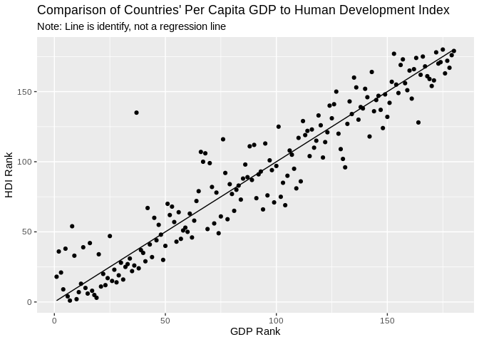

## Proxy discussion

Week 1 of DATA 607 considered proxies. Md Forhad Akbar evaluated per capita Gross Domestic Procuct as a proxy for standard of living, citing well-considered advantages and disadvantages. Akbar compared GDP and the Human Development Index, which appears in the United Nations Development Program's Human
Development Report.

Standard of living is an abstraction for which there is no objective measure. Therefore, HDI is
itself yet another proxy, and a comparison of GDP to HDI may not indicate the effectiveness of
GDP as a proxy for standard of living.

Still, a comparison of the two reveals their correlation, and since the two measures differ, it is
meaningful to consider which may be a better indication of standard of living. That is the topic of Akbar's post.

## Visualizing a proxy
The word proxy refers to one thing standing in for another. The measure of how well a variable stands in for another is their correlation. An effective visualization of the correlation of two variables is the scatterplot.

## Approach for comparing per capita GDP and HDI.
- Data sources
- Preparation
- Organization
- Plotting

### Data Sources
I obtained data from Wikipedia.

- [Per Capita GDP](https://en.wikipedia.org/wiki/List_of_countries_by_GDP_(PPP)_per_capita). I used GDP expressed in Purchasing Power Parity rather than nominal GDP. I used the table, "Central Intelligence Agency (1993–2017)".
- [Human Development Index](https://en.wikipedia.org/wiki/List_of_countries_by_Human_Development_Index). I copied these tables in order.
    - Very high human development
    - High human development
    - Medium human development
    - Low Human development

### Preparation
I copied and pasted the data into a buffer in Emacs. I wanted country lists in their ranked order. I used Emacs macros and manual deletions to eliminate unnecessary data.

When the text tables were sufficiently consistent in format, I pasted the GDP and HDI into separate Excel sheets within one workbook and dropped any remaining columns until each sheet had only one ordered column of country names. I added to each sheet a filled column of sequenced integers to produce a ranking value.

The Wikipedia sources made some distinctions between sovereign nations and unrecognized territories, which affected the numeric rankings. For this demonstration, I ignored such distinctions. I simply wanted ordered lists with no gaps in the ranking sequence.

This data cleansing approach is admittedly not very reproducible. It would be better to save a download of the web pages at a point in time and scrub the data with code. Emacs macros are useful for one-off tasks, but coding this with regular expressions would make it repeatable. I expect to do this later in the course, DATA 607.

### Organization
Using R and the package, openxlsx, I read each list into a data frame. I joined the lists on country using the dplyr package to produce a table of countries which have both a GDP and an HDI value. I could have examined the countries that appeared on one side only for possible disparities in spelling. I didn't do that for this demonstration, but there could be a few countries that could be added to the analysis with this cleansing step.

Since this introduced some gaps in the ranking, I ordered the merged data in turn by each of the two ranking variables (GDP and HDI) and added another integer sequence. I wanted rankings for each measure with no gaps in the sequences.

### Plotting
Organizing the countries sequentially for each of the two variables makes it possible to do a one-to-one comparison of the variables. A scatter plot of GDP and HDI will show their correlation. A perfect correlation would be represented by identical sequence indexes for GDP and HDI. If they were perfectly correlated, the scatter plot would fall on the identity line. I plotted the two variables and superimposed an identity line.


```r
## Read data.
gdp <- read.xlsx("CountriesRanks.xlsx", sheet = 1)
hdi <- read.xlsx("CountriesRanks.xlsx", sheet = 2)

## Eliminate countries that only have one of the two variabes.
gdp_hdi <- inner_join(gdp, hdi, by = "Country")

## Sequence each of the two variables.
gdp_hdi <- cbind(arrange(gdp_hdi, PerCapitaGDPRank),
                 "GDP_order" = seq_along(gdp_hdi$PerCapitaGDPRank))
gdp_hdi <- cbind(arrange(gdp_hdi, HDIRank),
                 "HDI_order" = seq_along(gdp_hdi$HDIRank))

## Plot
ggplot(gdp_hdi) +
        geom_point(mapping = aes(x = GDP_order, y = HDI_order)) +
        geom_line(mapping = aes(x = 1:nrow(gdp_hdi), y = 1:nrow(gdp_hdi))) +
        labs(title = "Comparison of Countries' Per Capita GDP to Human Development Index",
             subtitle = "Note: Line is identify, not a regression line",
             x = "GDP Rank",
             y = "HDI Rank")
```

<!-- -->

## Conclusions
It is important to note that the line in the plot is not a regression line. I did not run a regression analysis on the two variables. This is simply a visual comparison of, first, the per capita GDP to HDI and, second, the scattered points to a perfectly correlated identity line. Visual inspection suggests that both variables follow some degree of linear correlation. The degree of correlation could be quantified through further analysis.
